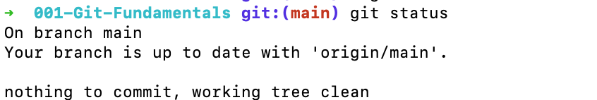
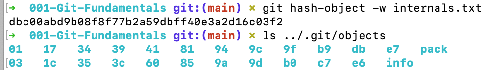
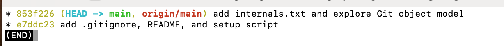
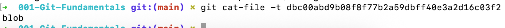

# Lab GIT-001 – Git Fundamentals & Workflow Mastery

**Company**: FameTech NYC  
**Role**: Junior DevOps Engineer – Internal Tooling Team  
**Duration**: 1–2 hours  
**Lab Level**: Beginner → Intermediate

---

## 🎯 Objective

Master foundational Git workflows and internals required in professional DevOps environments, with real-world file tracking, staging logic, and debugging strategies.

---

## Scenario – Version Control Foundation for Internal Automation Scripts

You’ve joined FameTech’s Internal Tooling team. You're tasked with setting up Git version control for Bash and Ansible scripts being developed for infrastructure automation. You'll structure the repo cleanly, ensure only relevant files are tracked, and demonstrate strong Git hygiene.

---

## Tasks & Concepts Covered

| Task Area                  | Skills Practiced                            |
| -------------------------- | ------------------------------------------- |
| Git Setup & Initialization | `git init`, `git config`, `.gitignore`      |
| Working Directory Logic    | `git status`, `add`, `restore`, `reset`     |
| Commit History & Structure | `git log`, `cat-file`, `hash-object`        |
| Internals Exploration      | `.git/objects`, blobs, trees, plumbing cmds |
| Best Practices             | Atomic commits, staging flow, `.gitignore`  |

---

## Step-by-Step Instructions

### 1. Initialize Git Repo & Identity

```bash
git init
git config --global user.name "Sheikh Ahmed"
git config --global user.email "sheikh@fametech.nyc"
```

Creates a `.git` folder and sets up user identity.

---

### 2. Create, Ignore, and Track Files

```bash
echo "node_modules/" > .gitignore
echo "Hello Git Workflow" > README.md
mkdir scripts && touch scripts/setup.sh
```

```bash
git status
git add .
git commit -m "Initial commit: Added .gitignore, README, and setup script"
```

Tracks changes with clean commit structure.

---

### 3. Git Internals & Object Storage

```bash
echo "Hello Git Internals" > internals.txt
git hash-object internals.txt
# Copy output hash, then:
git cat-file -p <hash>
ls .git/objects/
```

Reveals Git’s object model using blobs and plumbing commands.

---

### 4. Control Staging and Working Directory

```bash
echo "Update" >> README.md
git status

git restore --staged README.md       # Unstage file
git restore README.md                # Discard changes
git rm --cached internals.txt        # Untrack without deleting file
```

Demonstrates staging logic, clean-up, and version control hygiene.

---

### Bonus: Visualization & Amending

```bash
git commit --amend -m "Refactor: Improved setup commit message"
git log --oneline --graph --decorate
```

---

## Sample Output

```bash
$ git log --oneline
853f226 (HEAD -> main, origin/main) add internals.txt and explore Git object model
e7ddc23 add .gitignore, README, and setup script
(END)

$ git status
001-Git-Fundamentals git:(main) git status
On branch main
Your branch is up to date with 'origin/main'.
nothing to commit, working tree clean

$ ls .git/objects/
dbc00abd9b08f8f77b2a59dbff40e3a2d16c03f2
  db  e6  info
```

---

## Real-World Use Cases

| Scenario                    | Relevance                                    |
| --------------------------- | -------------------------------------------- |
| Starting DevOps repos       | Establishes Git structure & .gitignore       |
| Collaboration via GitHub    | Prepares for PRs and stable commits          |
| Debugging deployment errors | Understand commit history and Git internals  |
| Build pipelines & rollback  | Enables atomic changes & controlled releases |

---

## Interview Q\&A

> **Q**: What are Git’s 3 key areas?
> **A**: Working Directory → Staging Area → Repository.

> **Q**: Difference between `restore` and `reset`?
> **A**: `restore` affects working/staging files. `reset` can modify commit history too.

> **Q**: Why are atomic commits important?
> **A**: Easier rollback, cleaner history, better code reviews.

---

## Folder Structure

```bash
GIT-001-Git-Fundamentals/
├── .gitignore
├── README.md
├── internals.txt
├── scripts/
│   └── setup.sh
└── screenshots/         # Add logs, file tree visuals, git status snapshots
```

---

## Validation Checklist

| Item                          | Done |
| ----------------------------- | ---- |
| Git initialized               | ☐    |
| .gitignore configured         | ☐    |
| Files staged and committed    | ☐    |
| Internals explored (plumbing) | ☐    |
| Visual logs/screenshots added | ☐    |
| Interview prep reviewed       | ☐    |

---

## Suggested Screenshots

- `git status` before and after staging
- 
- Output of `.git/objects/` directory
- 
- `git log --oneline --graph` tree
- 
- `cat-file -p` blob preview
- 

---

## Bonus Knowledge

- `git cat-file -t <hash>` → shows object type
- `git fsck` → verifies internal structure
- `git restore --source=HEAD~1` → rollback files to previous commit
- `git tag v1.0` → semantic versioning for stable release

---

**Tip**: Always write meaningful commit messages and commit small, testable chunks. This lab mirrors what you’ll face on real DevOps teams using Git workflows daily.

---
